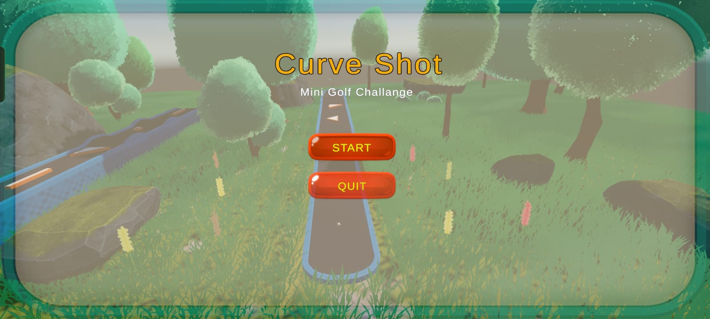
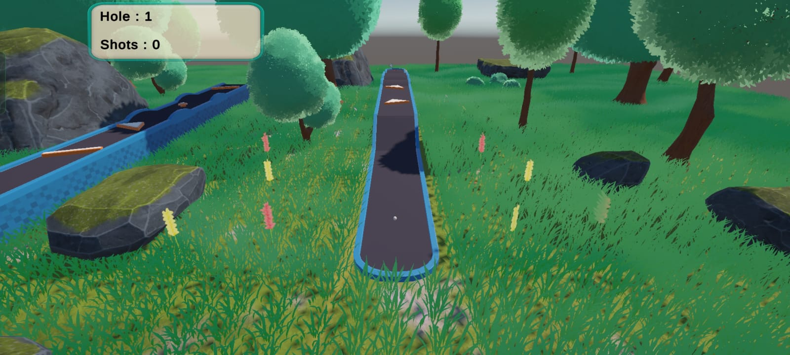

# ⛳ CurveShot - Hyper Casual Mini Golf Game


A hyper-casual mini golf game developed using **Unity 6** for **Android**.

CurveShot is a physics-based mini golf experience where players drag, aim, and release the golf ball to curve it around obstacles and reach the hole. The project focuses on intuitive touch controls, realistic physics, mobile optimization, and clean UI design.

---

# 🎮 Gameplay

The objective is simple but challenging:

- Drag to aim the golf ball.
- Adjust the shot power.
- Release to launch the ball.
- Curve around obstacles.
- Reach the hole using the fewest shots possible.

The game is designed around satisfying physics and precision-based gameplay.

---

# ✨ Features

- 🎯 Drag-and-release aiming system
- ⛳ Physics-based golf ball movement
- 🌀 Curved shot mechanic
- 🌳 Stylized low-poly environment
- 🕳️ Multiple golf holes
- 🏆 Hole completion detection
- 📱 Android support
- 📐 Landscape orientation
- 🎵 Main Menu UI
- ⚡ Mobile optimized

---

# 📱 Controls

| Action | Control |
|---------|----------|
| Aim | Drag on the screen |
| Adjust Power | Increase drag distance |
| Shoot | Release finger |

---

# 📸 Screenshots

<p align="center">
    
    
</p>

---

# 🎥 Gameplay Video

Gameplay demonstration:

> *(Upload the gameplay video to YouTube or Google Drive and paste the link below.)*

```
https://your-video-link-here
```

---

# 🛠 Built With

- Unity 6 (6000.4.7f1)
- C#
- Universal Render Pipeline (URP)
- Unity Physics
- Unity UI Toolkit / Canvas
- Android Build Support

---

# 📂 Project Structure

```
Assets/
│
├── Audio/
├── GolfAssets/
├── Materials/
├── Models/
├── Particles/
├── Prefabs/
├── Scenes/
├── Scripts/
├── UI/
└── Screenshots/

Packages/

ProjectSettings/
```

---

# 🚀 Getting Started

## Requirements

- Unity 6 (6000.4.7f1)
- Android Build Support
- Visual Studio 2022

---

## Clone Repository

```bash
git clone https://github.com/AsheedEliyangod/CurveShot.git
```

Open the project using:

```
Unity 6 (6000.4.7f1)
```

Open the scene:

```
Assets/Scenes/MainScene
```

Click **Play** inside the Unity Editor.

---

# 📦 Android Build

To build the APK:

```
File
→ Build Profiles
→ Android
→ Build
```

Install the generated APK on an Android device to play.

---

# 🎯 Implemented Mechanics

- Drag aiming system
- Shot power calculation
- Curved golf ball trajectory
- Rigidbody physics
- Collision detection
- Hole trigger detection
- UI navigation
- Scene Management
- Android deployment
- Mobile touch controls

---

# 📚 What I Learned

Through this project I gained experience with:

- Unity mobile game development
- Rigidbody physics
- Touch input handling
- UI design
- Scene management
- Android deployment
- Mobile optimization
- Git & GitHub workflow
- Project organization

---

# 📈 Future Improvements

- 🎮 More levels
- 🏆 Score system
- 📊 Shot counter
- ⏱ Timer mode
- 🔊 Sound effects
- 🎵 Background music
- 📋 Level selection
- ⏸ Pause menu
- ✨ Particle effects
- 🌍 Leaderboard
- 📈 Difficulty progression

---

# 📁 Repository Structure

```
Assets/
Packages/
ProjectSettings/
Screenshots/
README.md
.gitignore
```

---

# 👨‍💻 Developer

## Asheed Eliyangod

Game Developer passionate about creating interactive gameplay experiences using Unity and Unreal Engine.

### GitHub

https://github.com/AsheedEliyangod

---

# 📄 License

This project was created for educational purposes as part of a Unity game development assignment.

Feel free to explore the project and provide feedback.

---

# 🙏 Acknowledgements

- Unity Technologies
- Unity Asset Store
- Free stylized assets used for environment creation

---

# ⭐ Support

If you enjoyed this project, consider giving it a ⭐ on GitHub.

It helps support my work and motivates me to build more games.

---

## Thank You for Visiting!

More Unity and Unreal Engine projects coming soon 🚀
